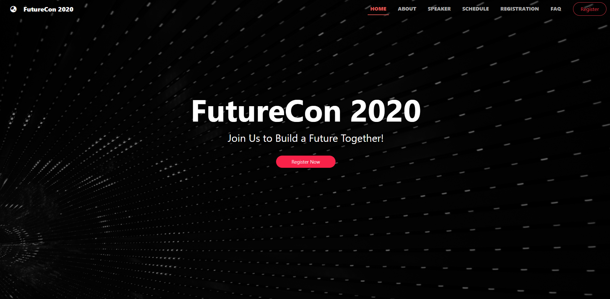

# FutureCon Conference Management System
This project is a prototype for a conference management system that is developed using Laravel framework. The main page of the project shows the information about a conference such as its date, venue, speakers and conference schedule. The project also provides an admin panel with functionalities for the conference organizer to up0date the main page of the website, as well as managing the attendance and admission of the conference participants.  

 

## Getting Started
To install and run this Laravel project:
1. Clone this repository.  

2. Create a database on your local machine.  

3. Rename `.env.example` file to `.env` in the project root directory. (If you can't directly rename the file using Windows File Explorer, open a command prompt and `cd` into your projecxt root directory and run `mv .env.example .env`)  

4. Edit the `.env` file with your database information.

5. Run `composer install`.  

6. Run `php artisan key:generate`.  

7. Run `php artisan migrate`.  

8. Run `php artisan db:seed` to run seeders.  

9. Run `php artisan storage:link` to perform storage link.  

10. Run `php artisan serve`.  

 

## Screenshot  
  
 

## Contributor  
- Chung Cheng
- Jun Siong
   

## License
The Laravel framework is open-sourced software licensed under the [MIT license](https://opensource.org/licenses/MIT).
